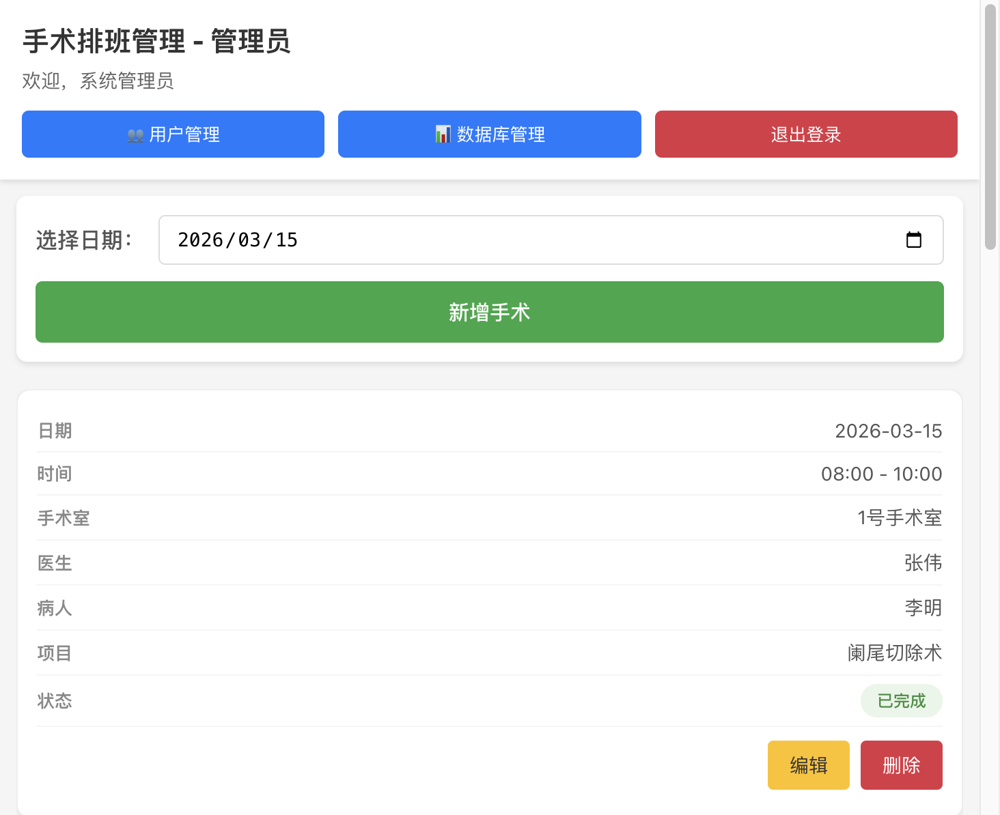
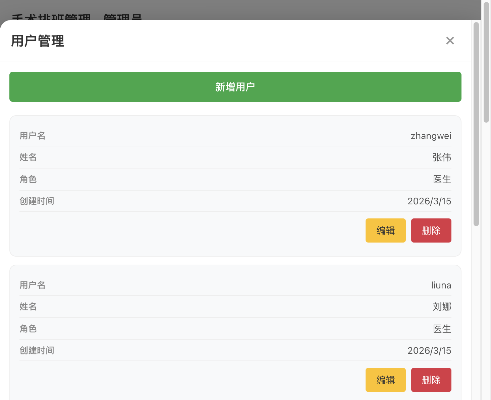
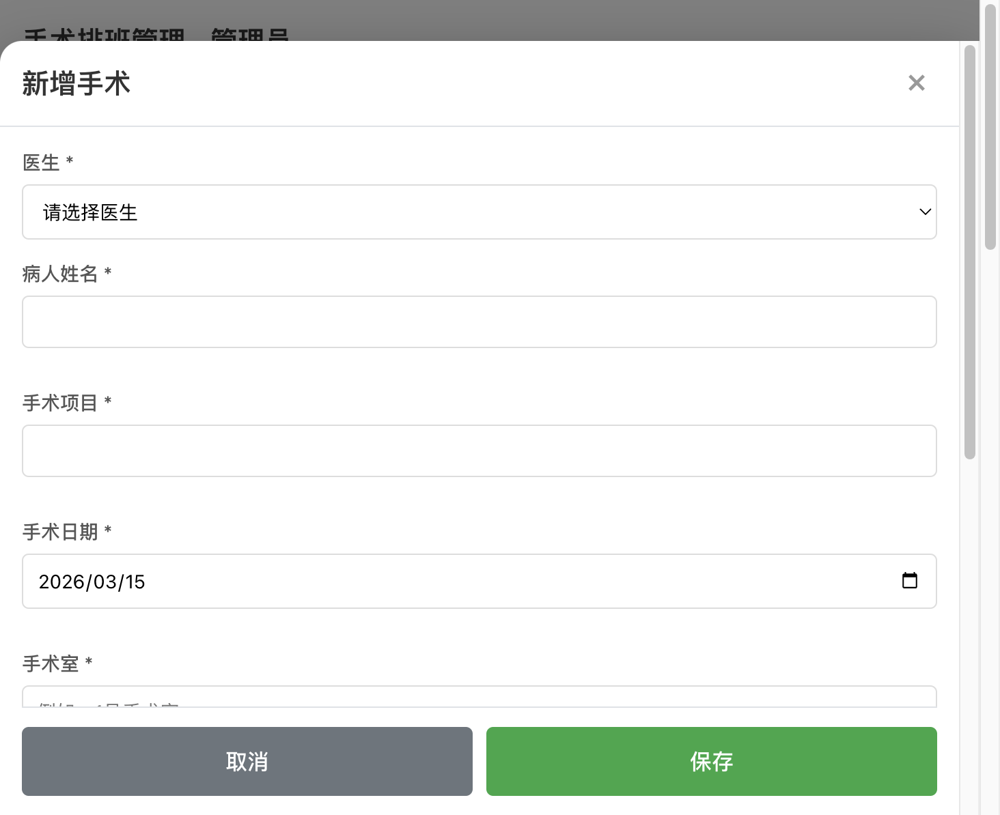
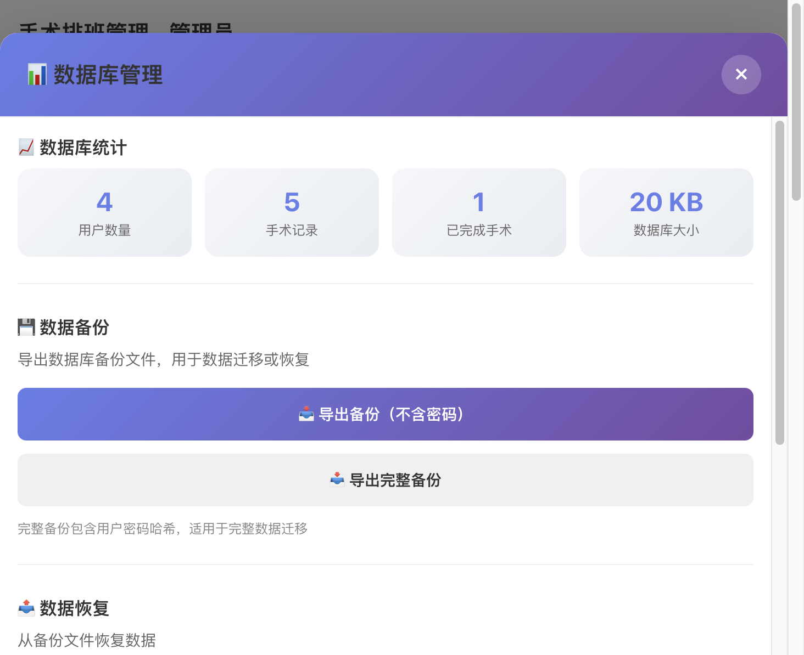

# 管理员操作手册

适用对象：管理员账号（admin）  
目标：规范执行用户管理、排班管理、备份恢复等操作

> 其他文档：[README](./README.md) · [完整使用说明](./USAGE_GUIDE.md) · [医生快速手册](./DOCTOR_QUICK_GUIDE.md)

---

## 1. 管理员职责

管理员拥有系统全部权限：

- **用户管理**：创建、编辑、删除医生账号
- **手术管理**：查看、编辑、删除所有医生的手术
- **状态管理**：修改手术状态（已安排 / 已完成 / 已取消）
- **数据管理**：查看统计、导出备份、导入恢复、清空数据

---

## 2. 管理面板概览

面板顶部三个入口：

| 按钮 | 功能 |
|------|------|
| 用户管理 | 管理医生账号 |
| 数据库管理 | 数据统计、备份恢复 |
| 退出登录 | 安全退出 |

中间区域为手术排班列表，可通过日期选择器切换日期查看。

---

## 3. 用户管理

点击「**用户管理**」进入用户管理面板。

### 3.1 新增医生

1. 点击「新增用户」
2. 填写信息：

| 字段 | 说明 |
|------|------|
| 用户名 | 登录用的账号名（全局唯一），建议用拼音或工号 |
| 密码 | 登录密码 |
| 姓名 | 显示名称 |
| 角色 | 选择 `doctor` |

3. 点击保存

### 3.2 编辑用户

点击用户卡片上的「编辑」，可修改姓名、用户名、角色。如需修改密码，在密码栏填写新密码。

### 3.3 删除用户

点击「删除」按钮。

> **限制**：如果该用户有关联的手术记录，系统会提示先处理手术再删除。

### 3.4 账号管理建议

- 使用规范命名（拼音 / 工号）
- 定期清理离职人员账号
- 不在群聊中传播账号密码

---

## 4. 手术管理

### 4.1 新增手术

点击「**新增手术**」，打开手术表单。

**管理员专属功能**：可以从下拉列表中选择**任意医生**来分配手术。

必填字段：医生、病人姓名、手术项目、手术日期、手术室、开始/结束时间。

系统自动校验同手术室同日期的时间冲突。

### 4.2 编辑手术

点击手术卡片上的「编辑」，可修改所有字段：

- 医生（可跨医生调整）
- 患者、手术项目
- 日期、时间、手术室
- 状态、备注

> 修改手术室 / 日期 / 时间后，系统会重新校验冲突。

### 4.3 修改手术状态

在编辑表单中修改状态下拉框：

| 状态 | 含义 |
|------|------|
| 已安排（scheduled） | 默认状态 |
| 已完成（completed） | 手术已结束 |
| 已取消（cancelled） | 手术已取消 |

> 只有管理员可以修改手术状态。

### 4.4 删除手术

点击「删除」后确认。删除后不可直接恢复，建议先备份。

---

## 5. 数据库管理

点击「**数据库管理**」进入数据管理面板。

### 5.1 数据统计

顶部卡片展示系统概况：

| 指标 | 说明 |
|------|------|
| 用户数量 | 所有账号（含管理员） |
| 手术记录 | 手术总条数 |
| 已完成手术 | 状态为「已完成」的数量 |
| 数据库大小 | SQLite 文件大小 |

### 5.2 数据备份

| 按钮 | 包含内容 | 适用场景 |
|------|----------|----------|
| 导出备份（不含密码） | 用户信息（无密码）+ 手术数据 | 日常归档 |
| 导出完整备份 | 用户信息（含密码哈希）+ 手术数据 | 完整迁移 / 灾难恢复 |

**备份频率建议**：
- 每天至少 1 次
- 大量数据变更后立即备份
- 执行高危操作前先备份

### 5.3 数据恢复

1. 选择备份 JSON 文件
2. 选择恢复模式：

| 模式 | 行为 | 风险 |
|------|------|------|
| 合并导入 | 保留现有数据，仅导入不重复记录 | 低（推荐） |
| 替换导入 | 先清空再完整导入 | 高 |

**恢复前操作清单**：

- [ ] 已导出当前数据备份
- [ ] 确认备份文件完整可读
- [ ] 在低峰时段执行
- [ ] 恢复后抽查关键日期数据

### 5.4 清空数据

**高危操作**，会删除所有数据仅保留 admin 账户。

执行前确认：
- [ ] 已完成最新备份
- [ ] 已获得业务负责人确认
- [ ] 在低峰时段执行

---

## 6. 日常工作清单

建议每天执行：

- [ ] 检查当日和次日排班情况
- [ ] 处理异常手术（取消 / 改期）
- [ ] 导出数据备份
- [ ] 检查是否有无效/停用账号需清理

---

## 7. 故障排查

| 问题 | 排查方向 |
|------|----------|
| 服务启动失败 | 端口是否被占用？依赖是否安装？ |
| sqlite3 编译错误 | 执行 `npm run rebuild-sqlite3` |
| 登录后 401/403 | Token 过期？JWT_SECRET 被改过？ |
| 看不到手术 | 日期筛选是否正确？是否刚执行了清空？ |
| 恢复后数据不对 | 确认用了正确的备份文件和恢复模式 |

---

## 8. 安全建议

| 项目 | 操作 |
|------|------|
| 默认密码 | 首次登录后立即修改 `admin123` |
| JWT_SECRET | 生产环境必须改为高强度随机字符串 |
| 网络 | 优先内网部署；外网必须 HTTPS |
| 账号 | 最小权限原则，医生只给 doctor 角色 |
| 备份 | 备份文件妥善存储，定期验证可恢复性 |

---

## 9. 交接清单

管理员交接时建议移交：

- [ ] 管理员账号和密码
- [ ] JWT_SECRET 值
- [ ] 最新数据备份文件及存放位置
- [ ] 备份命名规则
- [ ] 常见问题处理记录
- [ ] 服务器访问方式

---

> 配套文档：[完整使用说明](./USAGE_GUIDE.md) · [医生快速手册](./DOCTOR_QUICK_GUIDE.md)
