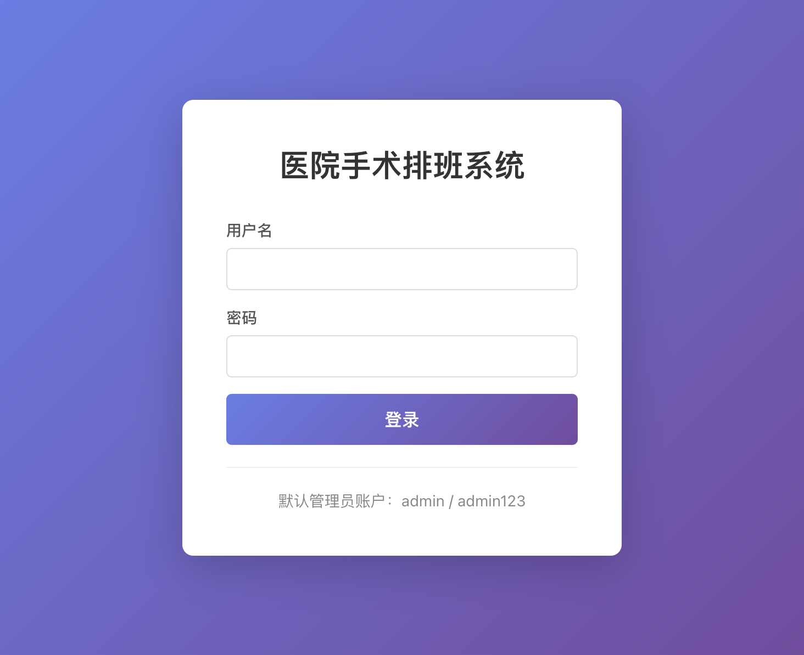
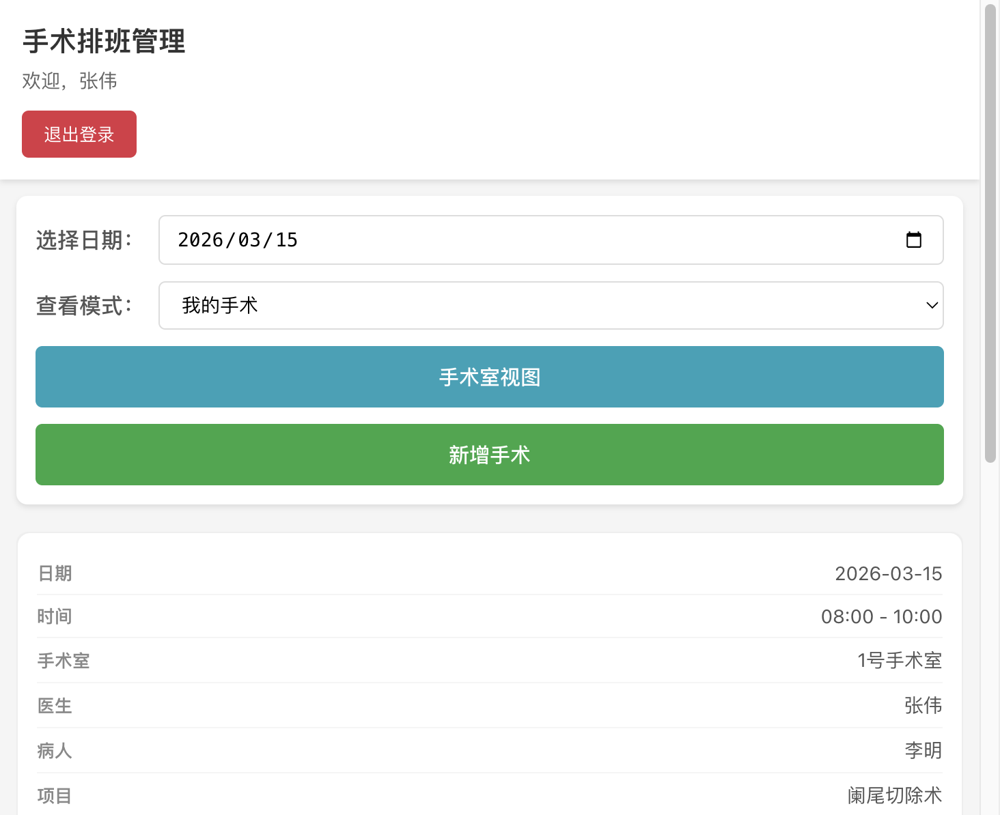

# 医院手术排班管理系统

一个面向医院科室的手术排班管理系统，支持 Web 浏览器、桌面应用（Electron）和手机端（PWA）多平台使用。


---

## 功能一览

| 功能 | 管理员 | 医生 |
|------|:------:|:----:|
| 查看手术排班 | 全部 | 仅自己 |
| 新增 / 编辑 / 删除手术 | 全部 | 仅自己 |
| 修改手术状态 | ✅ | ❌ |
| 用户管理（增删改医生账号） | ✅ | ❌ |
| 数据库管理（备份/恢复/统计） | ✅ | ❌ |
| 手术室时间冲突自动检测 | ✅ | ✅ |

---

## 快速开始（5 分钟上手）

### 环境要求

- **Node.js** >= 14（推荐 18/20 LTS）
- **npm** >= 6

### 第一步：安装依赖

```bash
npm run install-all
```

### 第二步：构建前端

```bash
npm run build
```

### 第三步：启动服务

```bash
NODE_ENV=production npm start
```

启动后终端会显示可访问的地址：

```
服务器运行在端口 3000
本地访问: http://localhost:3000
内网访问: http://192.168.x.x:3000
```

### 第四步：登录系统

打开浏览器访问 `http://localhost:3000`，使用默认管理员账户登录：

- 用户名：`admin`
- 密码：`admin123`



> **安全提示**：首次登录后请立即修改默认密码。

### 第五步：创建医生账户

登录管理员后，点击 **用户管理** → **新增用户**，填写医生信息即可。


---

## 核心操作截图

### 管理员：手术排班管理

管理员可查看所有医生的手术，按日期筛选，并可新增、编辑、删除任意手术。


### 新增/编辑手术

点击「新增手术」打开表单，填写医生、病人、手术项目、日期时间、手术室等信息后保存。系统会自动检测手术室时间冲突。


### 数据库管理

管理员可查看数据统计、导出备份、导入恢复、清空数据。


### 医生视图

医生登录后可查看自己的手术安排，新增和编辑自己的手术。



---

## 多平台访问

| 平台 | 访问方式 |
|------|----------|
| **电脑浏览器** | 直接访问 `http://服务器IP:3000` |
| **手机浏览器** | 同一局域网下访问同样地址，已适配响应式布局 |
| **手机 PWA** | 在手机浏览器中打开后，选择「添加到主屏幕」 |
| **桌面应用** | 使用 Electron 打包，支持 Mac / Windows / Linux |

### 手机端添加到主屏幕（PWA）

1. 手机连接到与服务器同一 WiFi 网络
2. 打开手机浏览器，输入 `http://服务器IP:3000`
3. **iOS**：点击 Safari 底部分享按钮 → 「添加到主屏幕」
4. **Android**：点击 Chrome 菜单 → 「添加到主屏幕」或「安装应用」

添加后可像原生 App 一样从主屏幕打开使用。

### 打包桌面应用（Electron）

```bash
# Mac
npm run electron:build

# Windows
npm run electron:build:win
```

生成的安装包在 `dist` 目录。

---

## 开发模式

如需开发调试，使用以下命令同时启动前后端热重载：

```bash
npm run dev
```

- 后端：`http://localhost:3000`
- 前端：`http://localhost:3001`（开发热重载）

---

## 项目结构

```
hospital-surgery-scheduler/
├── server/                 # 后端（Node.js + Express）
│   ├── index.js            # 服务器入口
│   ├── database/init.js    # SQLite 数据库初始化
│   ├── middleware/auth.js   # JWT 认证中间件
│   └── routes/             # API 路由
│       ├── auth.js         # 登录认证
│       ├── surgery.js      # 手术 CRUD
│       ├── user.js         # 用户管理
│       └── database.js     # 数据库管理
├── client/                 # 前端（React 18）
│   ├── src/
│   │   ├── components/     # 组件（手术表单、列表等）
│   │   ├── pages/          # 页面（登录、面板）
│   │   ├── services/       # API 服务 & 认证
│   │   └── styles/         # CSS 样式
│   └── public/             # 静态资源 & PWA 配置
├── main.js                 # Electron 主进程
├── data/                   # SQLite 数据库文件（自动生成）
└── package.json
```

## 技术栈

| 层级 | 技术 |
|------|------|
| 后端 | Node.js + Express + SQLite3 |
| 前端 | React 18 + React Router 6 |
| 认证 | JWT Token |
| 桌面 | Electron 27 |
| 移动 | PWA（Service Worker + Manifest） |

---

## 安全注意事项

生产环境部署前 **必须** 完成以下操作：

1. 修改 `.env` 中的 `JWT_SECRET` 为高强度随机字符串
2. 修改默认管理员密码 `admin123`
3. 公网部署时配置 HTTPS
4. 定期备份数据库（管理员面板支持一键备份）

---

## 常见问题

<details>
<summary><strong>Q：端口 3000 被占用怎么办？</strong></summary>

修改项目根目录 `.env` 文件中的 `PORT` 值，例如改为 `3001`，然后重新启动。

</details>

<details>
<summary><strong>Q：忘记管理员密码怎么办？</strong></summary>

删除 `data/hospital.db` 文件后重新启动服务，系统会自动创建新的默认管理员账户（admin / admin123）。

> 注意：这会清除所有数据。如需保留数据，请先导出备份文件。

</details>

<details>
<summary><strong>Q：如何备份数据？</strong></summary>

两种方式：
- **推荐**：管理员登录 → 数据库管理 → 导出备份（JSON 文件）
- **手动**：复制 `data/hospital.db` 文件

</details>

<details>
<summary><strong>Q：手机访问显示异常？</strong></summary>

确保手机和服务器在同一局域网内，使用服务器的内网 IP 地址访问（不要用 `localhost`）。

</details>

<details>
<summary><strong>Q：sqlite3 编译报错？</strong></summary>

执行 `npm run rebuild-sqlite3` 重新编译 native 模块。若仍失败，删除 `node_modules` 后重新 `npm install`。

</details>

---

## 详细文档

| 文档 | 适合谁 | 说明 |
|------|--------|------|
| [使用说明（完整版）](./USAGE_GUIDE.md) | 所有人 | 完整功能说明 + 操作流程 + 部署方案 |
| [医生快速手册](./DOCTOR_QUICK_GUIDE.md) | 医生 | 5 分钟上手，一页搞定日常操作 |
| [管理员操作手册](./ADMIN_OPERATION_GUIDE.md) | 管理员 | 用户管理、数据备份、故障排查 |

---

## 许可证

MIT License
